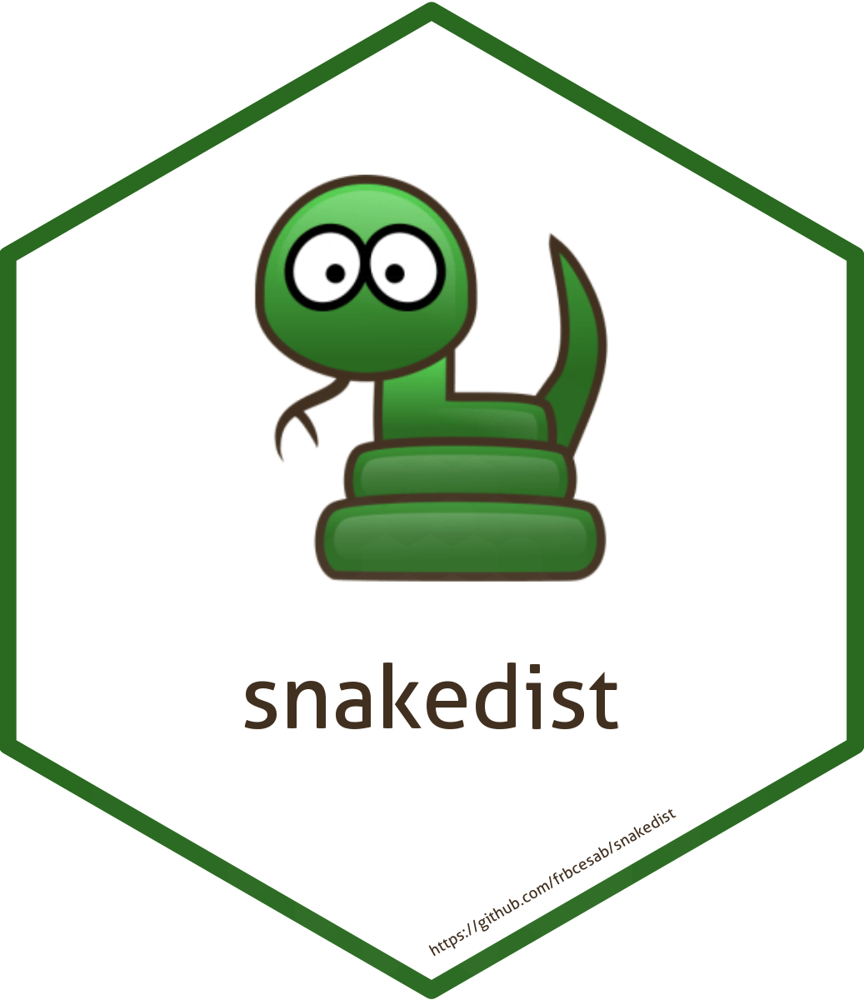

<!-- README.md is generated from README.Rmd. Please edit that file -->


```{r, include = FALSE}
knitr::opts_chunk$set(collapse  = TRUE,
                      comment   = "#>",
                      fig.path  = "man/figures/",
                      out.width = "100%")
```


snakedist 
=========================================================

<!-- badges: start -->
[](https://github.com/frbcesab/snakedist/actions/workflows/R-CMD-check.yaml)
[](https://github.com/frbcesab/snakedist/actions/workflows/pkgdown.yaml)
[](https://CRAN.R-project.org/package=snakedist)
[](https://choosealicense.com/licenses/gpl-2.0/)
<!-- badges: end -->


The goal of the R package `snakedist` is to compute distance between pair of points (survey locations) along a linear shape (e.g. a river, a road, etc.). Note that this package works even if the points are not exactly on the line.


This package has been developed for the
[FRB-CESAB](https://www.fondationbiodiversite.fr/en/about-the-foundation/le-cesab/) 
project 
[Bridge](https://www.fondationbiodiversite.fr/en/the-frb-in-action/programs-and-projects/le-cesab/bridge/) and it's related to the R package [`chessboard`](https://github.com/FRBCesab/chessboard).


## Installation

You can install the development version from GitHub with:

```{r eval = FALSE}
# install.packages("remotes")
remotes::install_github("frbcesab/snakedist")
```

Then you can attach the package `snakedist`:

```{r eval = FALSE}
library("snakedist")
```


## Overview

Please read the [Get started](https://frbcesab.github.io/snakedist/articles/snakedist.html) vignette.


## Citation

Please cite this package as: 

> Casajus Nicolas (`r format(Sys.Date(), "%Y")`) snakedist: An R 
package to compute distances along a linear shape. R package version 1.0.


## Code of Conduct

Please note that the `snakedist` project is released with a 
[Contributor Code of Conduct](https://www.contributor-covenant.org/version/2/1/code_of_conduct/). 
By contributing to this project, you agree to abide by its terms.
