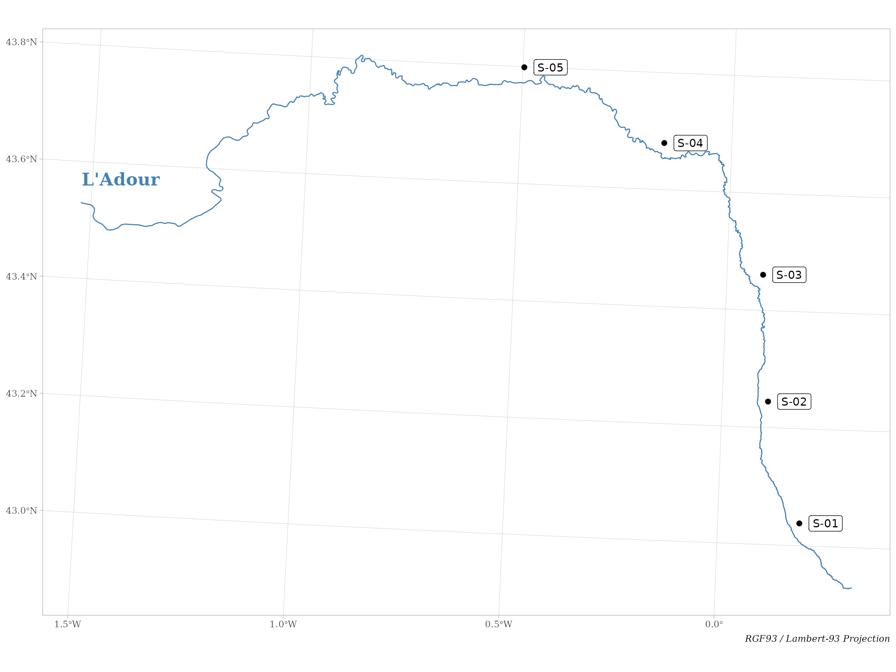

<!-- README.md is generated from README.Rmd. Please edit that file -->

# snakedist 

<!-- badges: start -->

[](https://github.com/frbcesab/snakedist/actions/workflows/R-CMD-check.yaml)
[](https://github.com/frbcesab/snakedist/actions/workflows/pkgdown.yaml)
[](https://CRAN.R-project.org/package=snakedist)
[](https://choosealicense.com/licenses/gpl-2.0/)
<!-- badges: end -->

The goal of the R package `snakedist` is to compute distance between
pair of points (survey locations) along a linear shape (e.g. a river, a
road, etc.). Note that this package works even if the points are not
exactly on the line.



This package has been developed for the
[FRB-CESAB](https://www.fondationbiodiversite.fr/en/about-the-foundation/le-cesab/)
project
[Bridge](https://www.fondationbiodiversite.fr/en/the-frb-in-action/programs-and-projects/le-cesab/bridge/)
and it’s related to the R package
[`chessboard`](https://github.com/FRBCesab/chessboard).

## Installation

You can install the development version from GitHub with:

``` r
# install.packages("remotes")
remotes::install_github("frbcesab/snakedist")
```

Then you can attach the package `snakedist`:

``` r
library("snakedist")
```

## Overview

Please read the [Get
started](https://frbcesab.github.io/snakedist/articles/snakedist.html)
vignette.

## Citation

Please cite this package as:

> Casajus Nicolas (2023) snakedist: An R package to compute distances
> along a linear shape. R package version 1.0.

## Code of Conduct

Please note that the `snakedist` project is released with a [Contributor
Code of
Conduct](https://www.contributor-covenant.org/version/2/1/code_of_conduct/).
By contributing to this project, you agree to abide by its terms.
